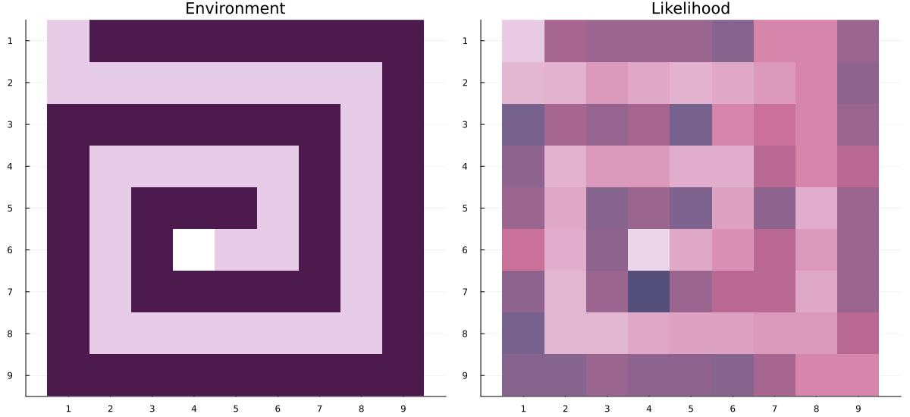

# ActiveInference.jl

[](https://samuelnehrer02.github.io/ActiveInference.jl/stable/)
[](https://samuelnehrer02.github.io/ActiveInference.jl/dev/)
[](https://github.com/samuelnehrer02/ActiveInference.jl/actions/workflows/CI.yml?query=branch%3Amaster)
[](https://codecov.io/gh/samuelnehrer02/ActiveInference.jl)
[](https://opensource.org/licenses/MIT)

## Julia Package for Active Inference.
ActiveInference.jl is a new Julia package designed to implement active inference within discrete state-spaces using Partially Observable Markov Decision Processes (POMDP's). With ActiveInference.jl you can define a generative model for active inference to run agent-based simulations. Additionally, we provide a functionality for fitting experimental data for parameter recovery. 


* Example visualization of an agent navigating a maze, inspired by the one described in [Bruineberg et al., 2018](https://www.sciencedirect.com/science/article/pii/S0022519318303151?via%3Dihub).
Left: A synthetic agent wants to reach the end of the maze environment while avoiding dark-colored locations.
Right: The agent's noisy prior expectations about the state of the environment parameterized by Dirichlet distributions being updated dynamically as it moves through the maze.

## Installation
Install ActiveInference.jl using the Julia package manager:
````@example Introduction
using Pkg
Pkg.add("ActiveInference")

using ActiveInference
````


## Getting Started 

### Understanding Vector Data Types in ActiveInference.jl
The generative model is defined using arrays of type Array{Any}, where each element can itself be a multi-dimensional array or matrix. For Example: 

If there is only one modality 
````@example Introduction

# Initializse States, Observations, and Controls
states = [25]
observations = [25]
controls = [2] # Two controls (e.g. left and right)

# Generate random Generative Model 
A_matrix, B_matrix = generate_random_GM(states, observations, controls);

# Here, the A_matrix is a one element Vector{Any} (alias for Array{Any, 1}) where the element is a 25x25 Matrix
size(A_matrix[1]) 

````

If there are more modalities
````@example Introduction

# Initializse States, Observations, and Controls
states = [25,2] 
observations = [25,2]
controls = [2,1] # Only the first factor is controllable (e.g. left and right)

# Generate random Generative Model 
A_matrix, B_matrix = generate_random_GM(states, observations, controls);

# Each modality is stored as a separate element.
size(A_matrix[1]) # Array{Float64, 3} with these dimensions: (25, 25, 2)
size(A_matrix[2]) # Array{Float64, 3} with these dimensions: (2, 25, 2)

````